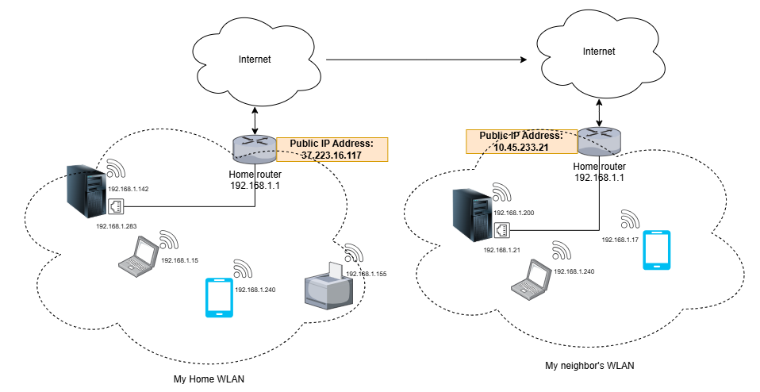

# Index
0. [Setup information](#0-setup-information)
    1. [Raspberry Pi - Model](#01-raspberry-pi-model)
    2. [Raspberry Pi - Operating System](#02-raspberry-pi---operating-system)
    3. [Raspberry Pi - Hard Disk Storage](#03-raspberry-pi---hard-disk-storage)
1. [Introduction](#1-introduction)
    1. [Active/Intrusive measurements](#11-activeintrusive-measurements)
    2. [Passive/Non-Intrusive measurements](#12-passivenon-intrusive-measurements)
    3. [Monitoring models](#13-monitoring-models)
    4. [Core concepts](#14-core-concepts)
        1. [IEEE 802.11 (WiFi Standard)](#141-ieee-80211-wifi-standard)
        2. [WEP, WPA, WPA2 and WPA3 (Security Standard)](#142-wep-wpa-wpa2-and-wpa3-security-standard)
        3. [AES (_Advanced Encryption Standard_) - Encryption algorithm and standard](#143-aes-advanced-encryption-standard---encryption-algorithm-and-standard)
    5. [DHCP](#15-dhcp-dynamic-host-configuration-protocol)
    6. [SSH](#16-ssh-secure-shell)
    7. [NAT](#17-nat-network-address-translation)
    8. [Important tools for this project](#18-important-tools-for-this-project)
2. [Configuring Raspberry Pi as a Wireless Access Point](#2-configuring-raspberry-pi-as-a-wireless-access-point)
    1. [Installing Ubuntu Server Operating System](#21-installing-ubuntu-server-operating-system)
    2. [Preparing the setup](#22-preparing-the-setup)
---
---

# 0. Setup information
## 0.1. Raspberry Pi - Model
_Raspberry Pi 4 Model B 4GB RAM_
## 0.2. Raspberry Pi - Operating System
_Ubuntu 24.04.1 LTS (Noble Numbat)_
## 0.3. Raspberry Pi - Hard Disk Storage
_64 GB (microSD)_

# 1. Introduction
Monitoring the home network may be interesting for users due to several reasons. For example, we might want to diagnose why our running online and multimedia applications inside the devices connected to the home network (i.e. LAN, _Local Area Network_) are experiencing problems in terms of QoS (_Quality of Service_) metrics such as network traffic bandwidth, packet losses, latency, Jitter or RTT (_Round Trip Time_) which have a direct impact on QoE (_Quality of Experience_); especially, latency between our devices and the target servers that provide online multimedia content is critical for a good user experience. We might also want to discover if our home network LAN is really secured against cyberattacks, or simply we are looking for a solution that allows us getting more control about what is happening behind.

There exist several approaches so as to monitor our home network traffic. Depending on how we want to do it, we have at our disposal some techniques that are exposed in Sections [[1.1](#11-activeintrusive-measurements)] and [[1.2](#12-passivenon-intrusive-measurements)]. The solution that is exposed in this tutorial is the latter (passive measurements) and, specifically, we will use Tshark [[1](#references)], as we want to get raw traffic data, which will let us further processing to obtain higher-level metrics like those of QoS (but not the other way round).

## 1.1. Active/Intrusive measurements
These techniques involve, by definition, the injection of network traffic to get the target measures. Thus, the injection can distort the results. For example:
- `pktgen` or packet train injection
- `iperf`: For C/S (_Client-Server_) connections and Bandwidth metrics
- `ping`
- `tracert` (or `traceroute`)

However, with these methods we cannot get lower-level metrics such as raw traffic data.

## 1.2. Passive/Non-Intrusive measurements
In contrast to active measurements, passive ones do not require to insert network traffic to the target LAN and we can use them to gather lower-level metrics (like raw traffic data). For example:
- Wireshark or Tshark: for raw traffic data
- Netflow `fprobe` and `nfdump`/`nfcapd`: does not provide the same level of detail as Wireshark/Tshark, but provides network flow-level statistics. A network flow is the traffic that happens for a fixed `[source_IP:source_Port, dest_IP:dest_Port], input_interface, IP_protocol, ToS (Type of Service)`
- `tcpdump`

In this case, the scope of the gathered metrics is limited to the device itself where the tool is being executed. This means that, for example, on condition that we are running Tshark in an external device, we won't be able to see the ongoing traffic between other devices in the LAN and the home router:


_In the diagram above, Raspberry Pi, which is running Tshark, would only have access to the traffic between home router and Raspberry Pi itself (red arrow)_

Although Tshark can run in promiscuous mode, that does not mean that we can capture the traffic intended for other devices in the same LAN.

> What is **promiscuous mode**? It is a configuration that instructs the NIC (_Network Card Interface_) to allow the network traffic to pass to the CPU regardless of whether that traffic is addressed to it or not (in other words, it prevents the network interface from filtering out network traffic: all the traffic will pass to the CPU) [[2](#references)]

> And when is a packet which is not addressed to a certain NIC received by that NIC? In some cases like (1) when the packet is intended to all the machines (i.e. the destination address is not the address of the NIC, but the broadcast address `FF:FF:FF:FF:FF:FF`, like in ARP or _Address Resolution Protocol_ or DHCP or _Dynamic Host Configuration Protocol_) or (2) when a packet is intended to a subgroup of the LAN (i.e. the destination address is not the address of the NIC, but the multicast address to which the NIC is enrolled). There are some additional special cases such as when a switch receives the packet and doesn't know what machine to send to (so it decides to send it to all the machines in the same LAN)

There is also another option in Tshark; the **monitor mode**, which is about capturing only IEEE 802.11 frames "_in the air_" (i.e. WLAN or _Wireless Local Area Network_ packets). In this mode, the network wireless interface configured in monitor mode disconnects from the WLAN and starts sniffing packets, even those not intended to it. However, these packets are usually encrypted (and not every device in the home network is connected wirelessly), so this option is not considered here, as we want to get metrics for the whole home network.

## 1.3. Monitoring models
We can assess some approaches for monitoring the home network LAN:
- Running **Tshark as a Software Agent** inside each host in the home network: this solution has several disadvantages. Firstly, not every device can download, install and run Tshark. Besides, this technique might be tedious as we would need to install the Tshark "Agent" and then configure it to dump data to an external database (e.g. running in an external device such as Raspberry Pi), which might have a negative impact (overload) on LAN performance


- Configuring a **SPAN (_Switched Port ANalyzer_)**: this consists of leveraging a built-in router feature which involves pulling out a copy of network traffic that passes through the router to an interface (also known as _switch port_) of that router. Although it is a striking idea, the drawback is that home router must have the built-in _Port Mirroring_ feature, so this option is not considered here. Furthermore, this method can have packet losses or delays, since router must implement the processing of copying and forwarding traffic


- Configuring an external device (such as Raspberry Pi) as a network **TAP** (_Test Access Point_ or also referred to as _Bridge_). Although the best approach to sniff all the packets, the worst consequence of this setup is the possibility that the whole home Internet connectivity cuts off (this would happen if Raspberry Pi turns off or reboots). This solution may negatively impact on latency performance, causing a bottleneck for the entire LAN. In this way, we have two options, but one of them does not make sense in some cases:
  - The first option (in the figure below, the left one) consits of connecting TAP between Home router and the Internet. This would make sense if the physical transmission media is Ethernet. However, nowadays the most common architecture in home networks is FTTH (_Fiber To The Home_), where we find that the physical media between home router and Internet (specifically, ISP or _Internet Service Provider_) is optical fiber. This means that the TAP ought to have optical interfaces at both ends (also known as ONTs or _Optical Network Terminators_). What's more: the link between our home router and ISP is controlled by ISP, and tapping into that link might violate ISP terms of service (so we won't consider this solution)
  - The second option (in the figure below, the right one) would imply having a mesh network (i.e. a subnetwork inside home network), where there is typically a central node connected to the home router by Ethernet. This is a very interesting approach, as, in case the TAP stops working, the devices in the home LAN could switch to the home router connection. The physical media between the main mesh-net node and the home router is Ethernet, so it is suitable for Raspberry Pi TAP. However, note that this solution needs that users have a mesh network installed in their homes, so it is not the best option for all the users looking for monitoring their home network traffic. In addition, as mentioned above, Raspberry Pi may cause a bottleneck for the mesh network due to the internal processing


- Using **built-in router Management Software**: this method implies that our home router **must** have the pre-configured possibility to be managed (for example, through built-in manufacturer software). This would be the best choice if the router comes with those kinds of tools, but we would also be limited to those tools constraints. For example, if looking for a fine-grained solution that consists of monitoring raw network data (e.g. in `.pcap` format), we might not address it by using built-in tools (unless those tools allow it). Besides, not all home routers come with this sort of software. If this is the workaround we opt for, we would need to request data to the running tool periodically and store it in an external database (e.g. running in a Raspberry Pi). Again, this solution might have an impact in home network performance because of the traffic overload of those requests


> **Idea**: even though many routers might not come with pre-configured managing tools, you can still connect to `192.168.1.1` (which is the typical address which represents your router in your home network) through any web browser and periodically retrieve metrics from there (e.g. with automated **web-scraping**)

- Configuring an external device (such as Raspberry Pi) as a **WAP (_Wireless Access Point_)**: although challenging, this technique is very interesting, since any user could monitor the network traffic just by configuring Raspberry Pi as a Wireless Access Point and, at the same time, we would avoid the TAP solution's own problems: if Raspberry Pi goes down, devices could switch to the home router's network. Furthermore, the home network wouldn't suffer from performance drops, as Raspberry Pi is not in the middle of the network link (like TAP solution) and users have the "freedom" to choose whether they want their traffic to be monitored (by connecting to Raspberry WAP) or not


For this project, we have opted for latest one (_Configuring Raspberry Pi as a Wireless Access Point_). Nonetheless, the idea is quite similar to the TAP too: we want the Raspberry Pi to be a WAP, but we will also configure it as a "dumb device" that will forward all the traffic from the WiFi interface to the Ethernet one so that the home router responds (and not the Raspberry Pi itself).

> Why configuring Raspberry Pi as a dumb device? The truth is that we could actually configure Raspberry Pi as a [DHCP](#15-dhcp-dynamic-host-configuration-protocol) Server, but we would need to select an IP range that doesn't overlap with the home router LAN's IP Addresses to prevent Raspberry Pi from assigning the same IP Addresses to the devices connected to it as those of the home router LAN. What's more: in case of configuring Raspberry Pi as a DHCP Server, note that further configuration should be made so as to let the communication between the Raspberry Pi's LAN and the home router's LAN (such as [NAT or _Network Address Translation_](#17-nat-network-address-translation))

## 1.4. WiFi concepts
### 1.4.1. IEEE 802.11 (WiFi Standard)
It is the WiFi standard defined by the IEEE Standards Association [[6](#references)]. Not all the standards are accessible for users. However, IEEE provides a program called _GET-Program_ [[7](#references)] where some public access standards can be viewed and downloaded [[8](#references)]. In this case, we are interested in the 802.11 standard [[9](#references)], which can be downloaded in PDF format.
In general, IEEE 802.11 standard gathers several specifications related to Wireless communications (refer to _Chapter 1, Section 1.3_), such as (among others):
- The functions/services that are involved in the operation of a device in a network
- Signaling techniques for the communication in physical layer
- How a device should work if it belongs to a WLAN that overlaps with other 802.11 WLANs
- The mechanisms for supporting QoS services over the WLAN

This document also includes a chapter for core definitions related to WLAN communications, which come from the _IEEE Standard Dictionary_.

Note that the IEEE 802.11 standard comprises other standards such as IEEE 802.11ax, IEEE 802.11ay, IEEE 802.11ba... [See [8](#references): _Standards and amendments_]. After the release of the IEEE 802.11 standard, the one which was adopted was IEEE 802.11b, followed by 802.11a, 802.11g, 802.11i, 802.11n and 802.11ac [[10](#references)]. Each one defines a maximum transmission rate (in _Mbps_) as well as different frequency bands, among others.

> How can I find the standard my home router is using? You can get access to the router managing interface by connecting to 192.168.1.1 (typically) from any web browser such as Google Chrome, Mozilla or Microsoft Edge. Admin user and password will be required; to find them, you can find it in your home router label. This information is commonly shown in _WLAN 2.4G or 5G_ information. Depending on the WiFi frequency (2.4GHz or 5GHz), the set of IEEE 802.11 standards may be different and more than one standard can be applied at a time

### 1.4.2. WEP, WPA, WPA2 and WPA3 (Security Standard)
WEP (_Wired Equivalent Privacy_) and WPA (_WiFi Protected Access)_ are security standards. Whilst WEP was developed by IEEE, WPA was later developed by WiFi Alliance as a solution to WEP weaknesses.

WEP was developed firstly to provide security in IEEE 802.11 wireless networks. Then, WPA replaced WEP due to the security concerns through the implementation of TKIP (_Temporal Key Integrity Protocol_) and, after WPA, newer versions were adopted:
- WPA2, which replaced TKIP with CCMP or _Counter mode with Cipher block chaining Message authentication code Protocol_, which, as the name suggests, means [AES](#aes-advanced-encryption-standard---encryption-algorithm-and-standard) in counter mode (CTR Mode) + CBC-MAC mode. WPA2 was used in IEEE 802.11i standard
- WPA3, the latest, strongest and most recommended security standard. It also uses CCMP.

When configuring your WLAN, you might find the term WPA2-PSK, which means _Pre-Shared Key_, or WPA3-SAE, which means _Simultaneous Authentication of Equals_. Both are often referred to as WPA2-Personal and WPA3-Personal, respectively, and are used in home networks (for personal use) and small offices rather than enterprises. In such cases, you will need to specify a password when connecting to the Access Point, and the password along with the Access Point SSID (_Service Set IDentifier_) will be used in the algorithm to provide confidentiality, integrity and authentication of exchanged data.

### 1.4.3. AES (_Advanced Encryption Standard_) - Encryption algorithm and standard
A standard for encryption of electronic data established by NIST (_National Institute of Standards and Technology_), as well as an encryption algorithm. For further information about how it works, see NIST FIPS PUB 197 (_Federal Information Processing Standards PUBlication 197_) [[12](#references)].

AES is an algorithm to encrypt data, so it provides confidentiality (i.e. the information must not be accessible for threat actors), and can be used in CTR Mode (_Counter Mode_).

AES can also operate in CBC-MAC mode (_Cipher Block Chaining - Message Authentication Code_) for data authentication (i.e. the other part of the communication must be who they claim to be) and integrity (i.e. to prevent data from being altered by threat actors).

## 1.5. DHCP (_Dynamic Host Configuration Protocol_)
Each device in a network has got several **interfaces**, which are really a way to reach that device. For instance, the mobile phones have got a Wireless Antenna for WiFi, or our computers may have Ethernet links that are connected to the home router. Sometimes, even the same computer may have two ways to reach it: through an USB WiFi Antenna or through Ethernet. That's why, actually, the host themselves don't have an IP Address, but the interfaces of that host. We can depict this as follows, where we show a network diagram which faithfully reflects what a LAN really is:


The DHCP Protocol assigns to each device interface an IP Address automatically, and runs in a _DHCP Server_ which typically is the home router itself (that's why DHCP Server is a Client/Server Protocol). The provided IP Addresses belong to a certain IP Address range (e.g. the `192.168.1.*`, where `*` denotes any value between 0 and 255 or, what is the same, `192.168.1.0/24` in CIDR or _Classes Inter-Domain Routing_ notation. We fill with zeroes the variable part in the CIDR notation).

> How can I find out the DHCP IP range my home router is providing? You can go to Home router's management interface by typing `192.168.1.1` (or your local router IP Address) from any web browser running on a device connected to the Home router's LAN and then look for _DHCP Server_ setting. You will generally see the DHCP range as well as the start and end IP Address that your router can assign to connected interfacess

Furthermore, apart from the IP Address, the DHCP Server provides to each interface the following information:
- The subnet mask, with which an interface can know whether a destination IP Address belongs to the LAN when sending a packet or it belongs to an external network
- The gateway IP Address, which is the IP Address of the next-hop router that will route the traffic outwards (in this case, the home router itself) 
- The DNS (_Domain Name System_) server, which will be in charge of mapping IP Addresses to Domain Names, which are more manageable than IP Addresses. The DNS Server will normally be the home router itself

> You can get this per-interface information by running `ipconfig /all` on Windows or `nmcli dev show <interface>` on Linux. To display the interfaces names on Linux, `ifconfig` or `ip addr`

DHCP operation is:
1. Interface sends a **DHCP Discover**: the interface wants to discover a DHCP Server. It doesn't have an IP Address yet, so it sends it from the source IP `0.0.0.0`. Neither does it know the target DHCP Server IP Address (it might be running in a different IP Address from 192.168.1.1), so it sends the query to the broadcast address (which means _every device in the LAN_): `255.255.255.255`
2. All the DHCP Servers respond with a **DHCP Offer**. In this packet, source IP is the DHCP Server IP Address (say `192.168.1.1`) and the destination IP is `255.255.255.255`, as the interface does not have an IP Address yet. The DHCP Offer offers the client a pool of available IP Addresses (not used by any device in the LAN yet) to the interface
3. The interface chooses one interface and sends a **DHCP Request**. The IP Address of the interface is not acknowledged yet by the router, so it still is `0.0.0.0`. However, the interface now knows the target IP Address of the DHCP Server that it wants to send the offer to, so the destination IP Address is indeed the DHCP Server IP Address.
4. The DHCP Server responds with a **DHCP ACK (or _Acknowledgement_)**

> This information exchange occurs whenever a new device enters the LAN. What's more: the assigned IP Addresses have an expiry date (e.g. they can expiry after 1 hour) and then they are assigned a new one from the pool.

> When a device exits the LAN, the pool of available IP Addresses to offer is automatically updated

Sometimes, we don't want the DHCP Server to assign a dynamic IP Address, but a **static** one. We can do it in two ways:
1. **DCHP Reservation**: we can access to Home Router management UI (_User Interface_) by accessing to `192.168.1.1` in from Web Browser on any computer connected to the LAN. This option is typically under _DHCP Binding_ option, and we will need to specify the MAC (_Medium Access Control_) Address of the interface, which is indeed a constant, physical and fixed address that is assigned by the manufacturer. The MAC Address can be checked with either `ipconfig /all` on Windows or `ifconfig` or `ip addr` on Linux

> You can even find out the NIC (_Network Interface Card_) brand by using online tools such as OUI Lookup [[14](#references)]

2. **Static IP Address assignation**: in this case, we force our device to have a specific IP Address by setting it in the device interface itself. This method depends on the underlaying Operating System and the device (whether it is a mobile phone, a computer or any other). For example, in Linux Operating Systems, this can be done via `dhcpcd` tool.

> Static IP Address assignation is not recommended, as there might be another device in the LAN using the same IP Address!

## 1.6. SSH (_Secure SHell_)
This is a cryptographic Application Layer Protocol (based on Client-Server architecture just like [DHCP](#15-dhcp-dynamic-host-configuration-protocol)) with which we will be able to connect to a remote _SSH Server_ and control it with a CLI (_Command Line Interface_) remotely, as though we were running the CLI inside the remote host.

When setting Raspberry Pi up with Ubuntu Server OS, we need to specify the user and password for SSH connection.

## 1.7. NAT (_Network Address Translation_)
In the Internet, there are lots and lots of devices (and interfaces). However, the number of IP Addresses that can be assigned to them is remarkably lower. An IP Address consists of four integer values, with 8 bits each:

> E.g. `192.168.1.1 => 11000000.10100010.00000001.00000001`

Consequently, there are a total of 2^32 = 4294967296 different IP Addresses, but not enough for all the devices in the world. Thus, the NAT can be used to assign any IP Address for the device interfaces inside a LAN (such as an office LAN, a home LAN, an enterprise LAN...) even though they are duplicated over the world (e.g. your mobile phone inside your home LAN may have the same IP Address as the Computer of your neighbour's LAN; let's say `192.168.1.124`). However: how can you send a packet from any device in your LAN to any device inside the neighbour's LAN? The response is: through NAT.

NAT magic is about taking a group of interfaces on the Internet and assigning them the same IP Address (i.e. there exists a representative IP Address for all of them). However, as you may have noticed, this wouldn't work in a real scenario, as the devices don't have a unique IP Address that identifies them. Therefore, the truth behind the NAT magic is that the devices are identified by the **ports** running on the representative device rather than the IP Address.

For example, in home NAT, the representative device is the home router and, more specifically, the interface that connects the router outwards (i.e. the ONT for _Fiber To The Home_ installations, which is connected through Optical Fiber to the ISP). In the image below, the IP Address for the ONT would be depicted in the orange square (called _Public IP Address_). Nonetheless, note that the inner IP Address that represents the home router is `192.168.1.1` (or similar, depending on your home configuration).



The NAT works as follows:


- We send a packet from a device in the Home LAN. For example, from our computer to a public server on the Internet (say `1.2.3.4`). The source IP is the IP Address of the computer, (in the example, `192.168.1.280`) and the destination IP is `1.2.3.4`. The rouce port is, for example, `8055` and the destination is `1234`
- The router receives that packet and overwrites the source IP Address from `192.168.1.280` to the public one (`37.223.16.117`) and the source port from `8055` to `2551`. Likewise, will store the IP Address of the computer (`192.168.1.280`) in the NAT table together with the source port (`8055`) to know to whom send the packet when the external server replies
- When the external server wants to respond, it will do it towards `37.223.16.117:2551`
- The router knows that `2551` is attached to `192.168.1.280:8055` because it stored that information in the NAT table

> To sum up: each device in the LAN have got an attached port (in the example, `2551`) that allows us to identify them.

And what about connecting directly to some device which is behind a NAT? For example, we want now to communicate to _My neighbor's computer_. We would need to know beforehand which is the port in the neighbor's NAT table that is attached to the destination device. However, this is usually dynamic and we typically have no access to this information (this is why NAT also grants privacy to the inner devices in the LAN), unless our neighbor has explicitly specified a static port for some running port of some device inside their LAN. This can be done via **Port Forwarding** (commonly in home router settings).

> How to find out your public IP Address? You can go to ifconfig.me [[15](#references)]

## 1.8. Important tools for this project
The following APT (_Advanced Packaging Tool_, the tool for managing software packages in a Debian-based Systems like Ubuntu) packages are needed to configure Raspberry Pi as a Wireless Access Point:
- `hostapd` (_Host Access Point Daemon_) [[5](#references)]: the most important one, will let us configure Raspberry Pi as an Access Point for IEEE 802.11 (i.e. the set of standards for WLANs)
- `dhcpcd5` (_[DHCP](#15-dhcp-dynamic-host-configuration-protocol) Client Daemon_) [[13](#references)]: this tool acts as a DHCP client. Summarizing, with this tool we can set a static IP address for our Raspberry Pi so that we can connect from another device. This is mandatory when configuring an Access Point
- `bridge-utils` [[16](#references)]: with this tool, we are able to merge two network interfaces into the same one. In this way, every traffic that passes to one of the bridged interfaces will be forwarded to the other one
- `wireless-tools`
- `tshark`
- `elasticsearch`

# 2. Configuring Raspberry Pi as a Wireless Access Point
You can follow [[3](#references)] on how to get started with Raspberry Pi.

## 2.1. Installing Ubuntu Server Operating System
There are several ways to install an Operating System in Raspberry Pi. The following steps are just an example of how you can do it, though.
1. On any computer you have, download and install **Raspberry Pi Imager** [[4](#references)]

> Raspberry Pi Imager is a tool that will assist user in downloading and installing images (i.e. Operating Systems) compatible with Raspberry Pi. This tool is not limited to Raspberry Pi OS, but it supports third-party OSs such as Ubuntu Server, which is the OS we are using in this tutorial

2. Plug a formatted and clean microSD or USB storage in that computer
3. Run Raspberry Pi Imager and select the Raspberry Pi model (in this case, see Section [[0.1](#01-raspberry-pi---model)]), the Operating System (in this case, Ubuntu Server, as specified in Section [[0.2](#02-raspberry-pi---operating-system)]) as well as the microSD/USB where the Operating System will be loaded (in this tutorial, we are using a MicroSD, as specified in Section [[0.3](#03-raspberry-pi---hard-disk-storage)]). To this end, select _Other general-purpose OS > Ubuntu > Ubuntu Server LTS_
4. Configure Internet connectivity (WLAN): this is optional, but recommended
5. Configure Timezone (highly recommended to prevent NTP or _Network Time Protocol_ related problems when your Raspberry Pi connects to the local home network LAN NTP Servers)
5. Configure hostname and user/password for [SSH](#16-ssh-secure-shell)

## 2.2. Preparing the setup
In this section we describe the setup to start configuring the Raspberry Pi. The target setup is depicted below:


Hereafter:
- The Ethernet interface that will carry the traffic between Raspberry Pi and home router will be referred to as `eth0`
- The Wireless interface that will be configured as a WAP will be referred to as `wlan0`
- The bridge interface that interconnects `wlan0` with `eth0` will be referred to as `br0`

> For testing purposes, it is highly recommended to use a **USB to Ethernet Adapter**. Generally, we can connect to Raspberry Pi by SSH via the wireless interface of Raspberry Pi (i.e. `wlan0`). However, when connecting to `wlan0` through SSH, we will need `wlan0` to be connected to the home router. If we connect to Raspberry Pi through `wlan0` using SSH and then configure `wlan0` as a WAP, `wlan0` will **disconnect** from home router LAN and we will lose access by SSH. We could connect through `eth0`, but the same happens when we configure the bridge interface (`br0` in the image above); we would lose access as soon as we add `eth0` to the bridge interface

First of all, we need to set a fixed IP Address for the SSH auxiliar interface so that we can connect to it specifying always the same IP Address. This is recommended because, otherwise, we would need to enter router management user interface in web browser to find out the IP Address that our router has assigned to that interface whenever we want to do tests, which may be inconvenient. For this purpose, see [DHCP](#15-dhcp-dynamic-host-configuration-protocol) protocol (_IP reservation is recommended for this. If your router doesn't support IP reservation, you can opt for static IP with dhcpcd_).

> To configure a **static IP** for some interface on Raspberry Pi, you can use `dhcpcd` tool. To do so, install `dhcpcd` on Raspberry Pi (`sudo apt upgrade && sudo apt install dhcpcd5`) and edit `/etc/dhcpcd.conf` like:
```
interface <iface_name>                          #You can get the iface_name with ifconfig or ip addr command
static ip_address=<desired_IP>/<subnet_mask>
```
> For instance: my home router LAN CIDR is `192.168.1.0/24`, starting from `192.168.1.128` up to `192.168.1.255`. Hence, we can choose anyone (like `192.168.1.200`) as `<desired_IP>`. The `<subnet_mask>` is the subnet mask that we will set to the interface. In this example, the home router LAN is `/24`, which means that all the devices in the LAN will coincide in the first 24 bits preffix (`192.168.1.*`). Therefore, It is advisable to use the same mask for our interface; in this way, our interface would recognize any `192.168.1.*` device as though it were in the same LAN. The configuration would result in `static ip_address=192.168.1.200/24`

Now, we will connect Raspberry Pi to power supply and then, from any computer in the home router LAN (e.g. your laptop), we need to connect via SSH to Raspberry Pi. Open PowerShell on Windows or GNU Bash Shell on Linux and run:

```Shell
ssh <SSH_auxiliar_iface_IP>
```

The next step is to install on Raspberry Pi's OS the tools described in Section [[1.8](#18-important-tools-for-this-project)]:

```Shell
sudo apt update #Update package repository database
sudo apt install hostapd #Install hostapd
sudo apt install dhcpcd5 #Install dhcpcd (if not yet)
sudo apt install tshark #Install tshark
sudo apt install bridge-utils #Install bridge-utils
```

Now, we are going to configure each tool to make WAP work.

### dhcpcd configuration
We have to use `dhcpcd` to configure static IP Addresses for the `wlan0` WiFi interface and the future `br0` bridge interface that we will configure later. Note that for both interfaces we cannot do IP reservation in home router, since none of them will connect to home router; `wlan0` will be WAP itself and `br0` will be a bridge between `wlan0` and `eth0`.
Nonetheless, we need an IP Address for `wlan0` due to ARP protocol

### dhcpcd configuration


---
---
# References
- [1] [Tshark Official Website](https://tshark.dev/capture/tshark/)
- [2] [What is Promiscuous Mode? Tech Target](https://www.techtarget.com/searchsecurity/definition/promiscuous-mode)
- [3] [Getting started with Raspberry Pi](https://www.raspberrypi.com/documentation/computers/getting-started.html)
- [4] [Raspberry Pi Imager Software](https://www.raspberrypi.com/software/)
- [5] [hostapd tool - Linux documentation page](https://wireless.docs.kernel.org/en/latest/en/users/documentation/hostapd.html)
- [6] [IEEE - Standards Association](https://standards.ieee.org/standard/)
- [7] [IEEE - GET Program details](https://standards.ieee.org/products-programs/ieee-get-program/)
- [8] [IEEE - GET Program available standards](https://ieeexplore.ieee.org/browse/standards/get-program/page)
- [9] [IEEE 802.11.2020 Standard document](https://ieeexplore.ieee.org/document/9363693)
- [10] [IEEE 802.11 standards family](https://en.wikipedia.org/wiki/IEEE_802.11)
- [11] [WiFi Alliance - WPA3 Standard Definition](https://www.wi-fi.org/system/files/WPA3%20Specification%20v3.1.pdf)
- [12] [NIST - AES algorithm details](https://www.nist.gov/publications/advanced-encryption-standard-aes)
- [13] [dhcpcd tool - Arch Linux documentation page](https://wiki.archlinux.org/title/Dhcpcd)
- [14] [OUI Lookup Tool](https://www.wireshark.org/tools/oui-lookup.html)
- [15] [What's my IP Address?](ifconfig.me/ip)
- [16] [Bridging connections - Debian Wiki](https://wiki.debian.org/BridgeNetworkConnections#Bridging_Network_Connections)